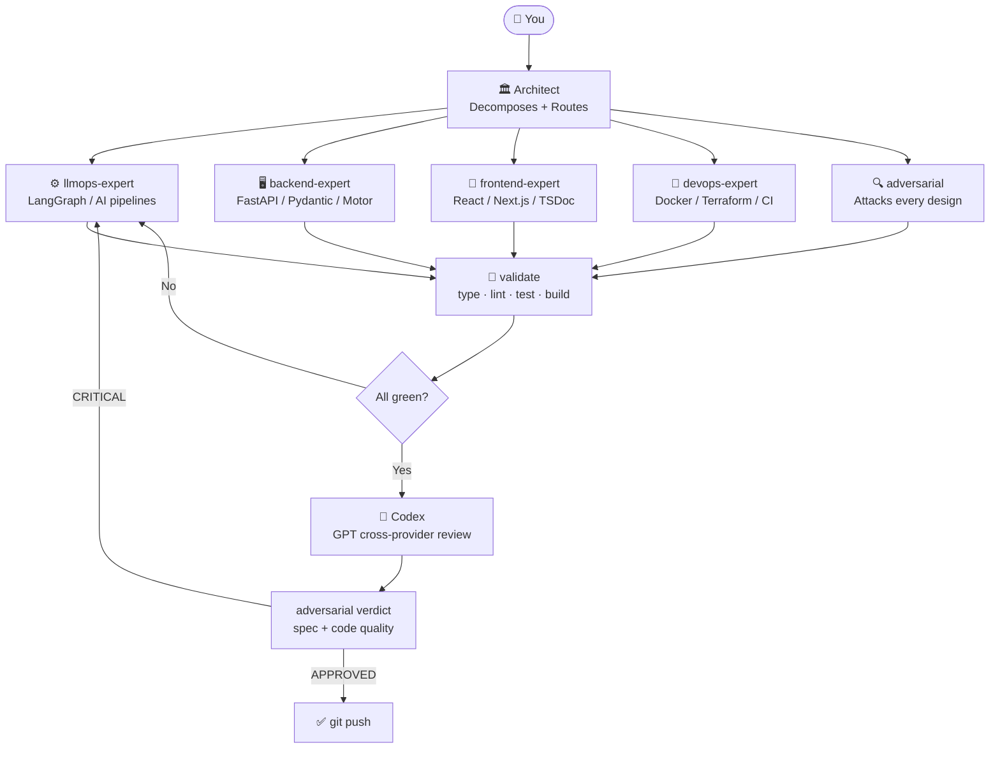
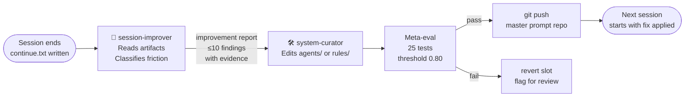
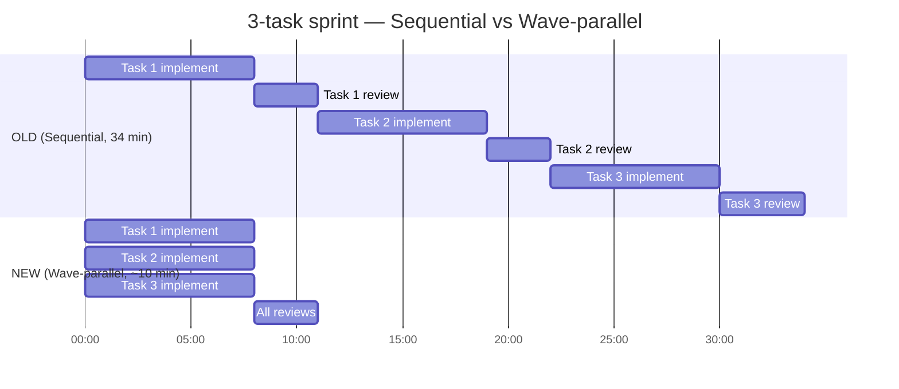
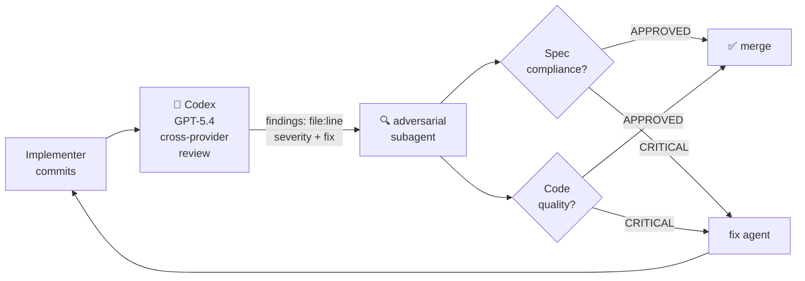
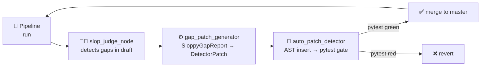

<div align="center">

# Claude Code Master Prompt

**A production operating system for AI-assisted engineering.**  
15 specialized agents · Wave-parallel dispatch · Cross-provider adversarial review · Self-improving via session debrief loop

[]() [](https://www.python.org/) [](https://nodejs.org/) [](https://aws.amazon.com/) [](https://www.terraform.io/) [](LICENSE)

[CLAUDE.md](CLAUDE.md) · [13 Agents](agents/) · [Rules](rules/) · [Case Studies](case-studies/)

</div>

---

## What This Is

This is the `CLAUDE.md` + `agents/` + `rules/` bundle installed on my machine and loaded automatically by Claude Code on every session. It turns Claude from a general assistant into a **coordinated team of 13 domain specialists** that work in parallel, attack each other's designs, and enforce quality gates before every commit.

Every rule in here was written in response to a specific, documented production failure. No best-practice cargo-culting.

---

## The Problem It Solves

Without a system, AI-assisted coding looks like this:

```
You ──► Claude ──► code ──► you review ──► Claude ──► more code
         (one model)  (one at a time)  (same model reviewing itself)
```

**Three failure modes:**
1. **Sequential**: one task at a time, even when 5 tasks share zero files
2. **Single-model review**: Claude reviewing Claude's own code catches ~60% of issues
3. **Context pollution**: 8,000-line CI logs burning the entire session budget

With this system:

```
You ──► Architect (decomposes) ──► 5 specialists fire in parallel
                                  ──► Codex (GPT, cross-provider) attacks the diff
                                  ──► adversarial agent issues verdict
                                  ──► validate gate before commit
```

---

## Architecture



---

## The 15 Specialists

| Agent | Model | Owns |
|-------|-------|------|
| 🏛️ **architect** | Sonnet | Decomposes work into DAG tasks, routes to experts, never writes code |
| 🤖 **llmops-expert** | Sonnet | LangGraph nodes, PipelineState, `.with_structured_output()`, orchestrator wiring |
| 🖥️ **backend-expert** | Sonnet | FastAPI/NestJS routes, Motor async DB, Pydantic v2, rate limits, auth |
| 🎨 **frontend-expert** | Sonnet | React 19, Next.js 15, Zustand, React Query, SSE hooks, Jest+RTL, TSDoc |
| 🚀 **devops-expert** | Sonnet | Docker, GitHub Actions, Terraform, Railway, Vercel, secrets management |
| 🔍 **adversarial** | Sonnet | Attacks designs, OWASP scans, read-only diagnostics |
| 🔬 **researcher** | Sonnet | Primary-source citation packs, grounding, prevents hallucination |
| 🕷️ **scraper** | Sonnet | HTTP (httpx) + browser (playwright), ASP.NET forms, anti-bot, soft-block detection |
| 📝 **prompt-engineer** | Sonnet | Prompt files, versioning, G-Eval rubric authoring |
| 📊 **eval-writer** | Sonnet | deepeval/RAGAS datasets, JSONL fixtures, Layer 1/2/3 metric selection |
| 🧪 **sme-reviewer** | Sonnet | Subject-matter review — fact accuracy, audience fit |
| ✍️ **drafter** | Haiku | Fallback implementer for any task with no exact expert match — TDD first |
| ✅ **validate** | Haiku | Pre-commit gate: type check → lint → format → tests → build |
| 🔎 **session-improver** | Sonnet | End-of-session debrief: reads continue.txt, extracts friction/violations/token waste, routes findings to system-curator |
| 🛠️ **system-curator** | Sonnet | Updates agent cartridges, rules, case studies in the master prompt repo; runs meta-eval; commits and pushes |

> Haiku for cheap gates (10× less than Sonnet). Sonnet for everything that generates or reviews code. Opus reserved for cross-cutting architecture — used rarely.

---

## The Self-Improvement Loop

The system improves itself after every session. `session-improver` reads what went wrong. `system-curator` fixes it. The next session starts smarter.



**What triggers a self-improvement session:**
- Session ends with a `continue.txt` that has lessons or friction > 10 min
- The same mistake appeared 2+ times in a session
- A bug was fixed that an existing rule should have caught
- Token spend exceeded $1.00 (session-autopilot flags it)

**What it CANNOT do:** propose rules without a specific incident. "Claude should be more careful" is not a finding. A UnicodeEncodeError on cp1252 at line 203 of `_print_report` on 2026-07-21 is a finding.

---

## Wave-Parallel Dispatch

The key insight: **most tasks in a sprint share zero files**. Sequential dispatch is pure waste.



**Measured on 2026-07-13**: 3-task sprint went from **34 min → ~10 min**.

The rule is simple: before dispatching ANY implementer, scan ALL remaining tasks. Every task with no file overlap fires in the same message wave.

---

## Quality Gate — Dual Review

Every task goes through two review layers before merging:



**Why cross-provider?** Claude reviewing Claude catches ~60% of issues. GPT-5.4 attacking a Claude diff catches the rest — different training priors surface different blind spots.

Rule: **Zero Codex calls in a sprint = failed session.**

---

## Cost-Aware Model Routing

```
Task type                         Agent          Model     Cost
─────────────────────────────────────────────────────────────
Read / search / lint / format  →  validate       Haiku     1×
                                   drafter
─────────────────────────────────────────────────────────────
Write / review / multi-file    →  all others     Sonnet    ~10×
─────────────────────────────────────────────────────────────
Architecture cross-cutting     →  architect      Opus      ~40×
(rare, only when genuinely
 needed for tradeoffs)
─────────────────────────────────────────────────────────────
```

**CLAUDE.md token efficiency**: the main router is 107 lines. Deep rules live in `rules/` files loaded on demand — zero token cost when the task is out of scope. Previously: 1,300 lines loaded every session.

---

## Case Studies

### Case Study 1 — Peru Government JSF Scraper

> Technical interview for a remote contract role (Chile/LatAm, USD). Delivered in 48 hours.

```
Target: 2 Peruvian government portals running JSF/PrimeFaces and RichFaces
Stack: TypeScript · httpx · cheerio · 7-layer architecture
```

**Results:**
- 43,750 documents scraped across two portals
- 998 PDFs downloaded and verified
- Soft-block detection: auto-pause on 429/503 patterns
- 53 tests, 0 failures at delivery
- The JSF session-state problem (ViewState + hidden fields in ASP.NET-style forms) solved with a custom protocol layer

[Full case study →](case-studies/pj-peru-scraper-2026-06-28.md)

---

### Case Study 2 — The Machine That Patches Itself

> 24-hour session building a Darwin Gödel Machine–style self-improvement loop for a LangGraph content pipeline.



**The loop found 9 bugs in its own scaffolding before reaching cycle 2:**

| # | What broke | Root cause |
|---|-----------|-----------|
| 1 | Gate values null | Return dict missing 3 keys |
| 2 | GrammarReport crash | LLM returns `[]`, `model_validate([])` raises |
| 3 | pytest not found | `"python"` not in PATH on Windows uv env |
| 4 | Unicode crash `─` | Windows cp1252 has no box-drawing chars |
| 5 | LangSmith 429 flooding | Tracing enabled, monthly quota exceeded |
| 6 | Runs die on shell exit | Background `&` receives SIGHUP on shell close |
| 7 | Test roundtrip mismatch | `pattern_text ≠ suggested_entry` — word not in content |
| 8 | SyntaxError in generated test | `{word!r}` → `repr()` injects double-quotes into f-string |
| 9 | Unicode crash `→` | Same cp1252 issue, different char |

**Outcome**: 1 successful auto-heal patch applied (2 regex patterns, merged as `bcb9d34`). `ai_slop_passed` went `False → True` in Cycle 1. The machine that patches itself needed Claude Code to patch the machine.

[Full case study →](case-studies/self-improvement-loop-2026-07-21.md)

---

## Rules From Real Failures

These aren't "best practices" — each rule has a specific incident behind it.

| Rule | The Failure |
|------|------------|
| Pre-commit Docker build gate | Package in source, not in `pyproject.toml` → passed all tests, crashed Docker on deploy with `ModuleNotFoundError` |
| 5-agent minimum for independent tasks | 3 independent files ran sequentially → 40+ min for 12 min of work |
| Unicode-normalizer in every Pydantic validator | LLM returned curly-quote JSON → `json.loads` failed on 3% of production traffic, passed every unit test |
| `git branch --show-current` before CI triggers | Workflow committed with `branches: [main]` to a `master`-default repo → CI never fired |
| 3-shot positive YAML exemplars in agent cartridges | 3 layers of "do not route to integrator" prose all ignored by Sonnet training priors → exemplars showing `agent: llmops-expert` fixed it |
| `sys.executable` in subprocess calls | `"python"` not in PATH on Windows uv envs → pytest not found in auto-patch loop |
| `nohup` for background pipeline runs | `&` jobs die on SIGHUP when their shell exits → 24-hour loop died 3 times |
| Codex runs in controller, not as subagent | Same-provider, same-model review catches ~60% of issues → GPT-5.4 cross-provider catches the rest |

---

## Cartridge-v2 Template

Every agent follows a fixed 10-slot layout — making them **mechanically evaluatable**.

```
┌─────────────────────────────────────────────────────────────┐
│  Slot 1 · ROLE          Who I am + what I never do          │
│  Slot 2 · HYDRATION     Files I must read before acting     │
│  Slot 3 · TRIGGERS      When the controller routes here     │
│  Slot 4 · PATTERNS      Canonical code shapes + 3 exemplars │
│  Slot 5 · HANDOFF       My structured output contract       │
│  Slot 6 · REVIEW        What my reviewer checks             │
│  Slot 7 · SELF-CRITIQUE Pre-return checklist                │
│  Slot 8 · ESCALATION    When to call Codex rescue           │
│  Slot 9 · BOUNDARIES    What I explicitly don't do          │
│  Slot 10 · COST BUDGET  My model tier + max-turn ceiling    │
└─────────────────────────────────────────────────────────────┘
```

A 24-case meta-eval dataset scores every cartridge:
- **30%** slot coverage
- **50%** correctness
- **20%** cost efficiency
- Pass threshold: **0.80** · Current: **25/25 tests passing**

---

## Sprint Status Tree

Every sprint prints a live tree — before agents launch and after each completion wave.

```
😸 Sprint 27 — activo
├── 🤖 agentes  — 4 parallel (llmops-expert · backend-expert · drafter · adversarial)
├── 🧠 skills   — brainstorming → writing-plans → parallel-executor
├── 📊 metrics  — tests 1,621→1,666 · TS 0 errors · build ✅
├── ✅ slop_judge_node.py     — draft vs detector comparison
├── ✅ gap_patch_generator.py — SloppyGapReport → DetectorPatch
├── 🔄 auto_patch_detector.py — AST insert + pytest gate
└── 🔍 Codex (bg)            — adversarial review Sprint 27
```

---

## Stack Coverage

| Layer | Technologies |
|-------|-------------|
| Frontend | React 19, Next.js 15, TypeScript strict, Zustand, React Query, Jest + RTL, Playwright |
| Backend | Python/FastAPI, Node.js/NestJS, Motor (async MongoDB), Pydantic v2 |
| AI / LLMOps | LangChain, LangGraph, structured output, deepeval / RAGAS, LangSmith / Langfuse |
| Infrastructure | AWS (Lambda, Step Functions, Bedrock), Terraform, Docker, GitHub Actions |
| Deploy | Railway, Vercel, AWS ECS / Lambda |
| Databases | MongoDB (Motor), PostgreSQL |

---

## How to Install

```bash
git clone https://github.com/GatoProgramador-01/claude-code-master-prompt.git
cd claude-code-master-prompt

# 1. Thin router — loaded by Claude Code every session
cp CLAUDE.md ~/CLAUDE.md

# 2. 13 agent cartridges
mkdir -p ~/.claude/agents
cp agents/*.md ~/.claude/agents/

# 3. Rules bundle (lazy-loaded, on-demand)
bash scripts/install-rules.sh
```

**Required plugins:**

```bash
# Superpowers — brainstorm → plan → parallel-executor → TDD → review
/plugin marketplace add obra/superpowers
/plugin install superpowers@superpowers-dev

# Codex — GPT cross-provider adversarial review
/plugin marketplace add openai/codex-plugin-cc
/plugin install codex@openai-codex
/codex:setup
```

**Installed layout:**

```
~/
├── CLAUDE.md                  ← 107-line router (every session)
└── .claude/
    ├── agents/
    │   ├── architect.md        ← Sonnet: orchestrator
    │   ├── llmops-expert.md    ← Sonnet: LangGraph + pipelines
    │   ├── backend-expert.md   ← Sonnet: FastAPI + Motor + Pydantic
    │   ├── frontend-expert.md  ← Sonnet: React + Next.js + TSDoc
    │   ├── devops-expert.md    ← Sonnet: Docker + Terraform + CI
    │   ├── adversarial.md      ← Sonnet: attack + OWASP + diagnostics
    │   ├── validate.md         ← Haiku: pre-commit gate
    │   ├── researcher.md       ← Sonnet: web research + grounding
    │   ├── scraper.md          ← Sonnet: HTTP + browser scraping
    │   ├── drafter.md          ← Haiku: fallback implementer, TDD
    │   ├── prompt-engineer.md  ← Sonnet: prompts + rubrics
    │   ├── eval-writer.md      ← Sonnet: datasets + evaluators
    │   └── sme-reviewer.md     ← Sonnet: subject-matter review
    └── rules/                 ← lazy-loaded, on-demand
        ├── workflows.md        ← parallel wave patterns + team recipes
        ├── codex-routing.md    ← Codex cadence + failure modes
        ├── sprint-status.md    ← status tree spec
        └── hooks.md            ← PostToolUse / PreToolUse / Stop
```

---

<details>
<summary><strong>Sprint History</strong></summary>

| Sprint | What Shipped |
|--------|-------------|
| Self-improvement loop + system curator (2026-07-21) | Darwin Gödel Machine–style loop in medium-agent-factory: 9 bugs fixed, 1 patch auto-applied. Meta-loop: session-improver + system-curator agents added — the system now improves itself after every session |
| Cartridge v2 (2026-07-09) | 10-slot template, 3-shot exemplars, roster → 13 agents, CLAUDE.md 391→107 lines, 24-case meta-eval, 25/25 tests |
| parallel-executor (2026-07-13) | Wave-parallel dispatch replaces sequential SDD — 34 min → ~10 min for 3-task sprint |
| Group of Experts v1 (2026-07-03) | 14 specialized agents, auto-compact policy, session-autopilot skill |
| SDD × GoE routing | Per-task routing table, Codex wired into SDD review, mandatory parallel wave dispatch |
| LLMOps architecture | 3-layer eval (score direction / batch regression / LLM-as-judge), prompt versioning, LangSmith |
| Token efficiency | Model-per-role routing, CLAUDE.md lazy-loading, sub-agent context isolation |
| Docker-first + CI/CD | 5-job pipeline template, Motor + pytest-asyncio event loop fix, pre-commit Docker gate |
| AWS SSO + serverless | Day-1 SSO guide, 3-layer multi-agent model, Lambda + DLQ + X-Ray |
| Terraform hardening | HCL attribute syntax, `lifecycle` inside resource, OIDC not static keys |
| Hooks system | PreToolUse force-push block, PostToolUse auto-formatter, Windows idle notification |
| Scraper agent | HTTP (httpx) + browser (playwright), soft-block detection, sanity checks |
| Foundation | Tech lead + DevOps role, TDD Red→Green→Refactor, Python conventions |

</details>

---

## Rollback

```bash
rm -rf ~/.claude/agents/*.md ~/.claude/agents/archive/
cp -r ~/.claude/agents-backup-v1/*.md ~/.claude/agents/
```

Restores v1 cartridges exactly.

---

## License

MIT — see [LICENSE](LICENSE).
